# Matplotlib-Challenge: Charles Phil Week 5 Homework

## Observations and Insights

For observations and insights, please open **pymaceuticals_notebook.ipynb**.

## Code Breakdown

### Dependencies and Setup

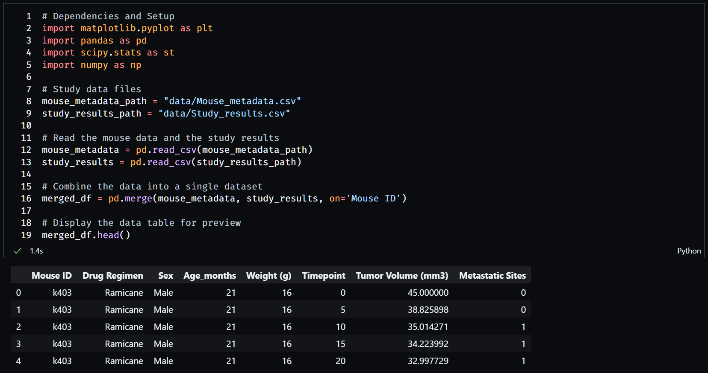

Straightforward imports, although I did add in numpy to create a range of numbers later on. We see that we have 249 unique mice based on the mouse ID.

### Checking for Duplicate Entries

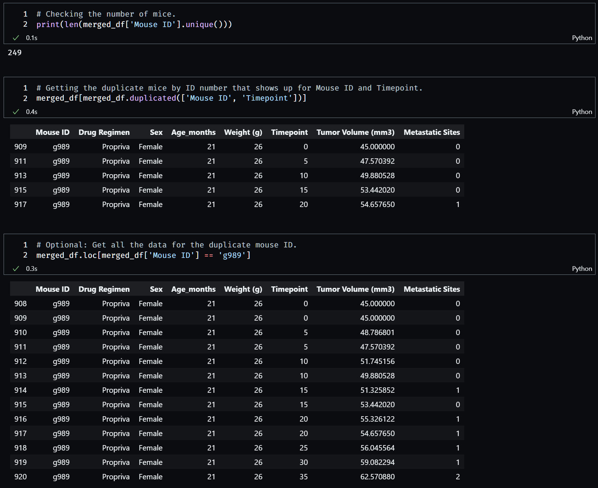

Here, I checked for the number of unique mice from the merged dataset and checked for any duplicate entries among each mouse ID and the timepoint. If there were duplicates of **both** the ID and timepoint, then I would get a dataframe of rows where ID and timepoint were duplicated. This results in a data frame showing mouse g989 and the timepoints 0, 5, 10, 15, and 20. Showing the subset where mouse ID is g989 reveals that g989 does indeed have too many recorded points.

### Excluding the Mouse ID with Duplicated Results

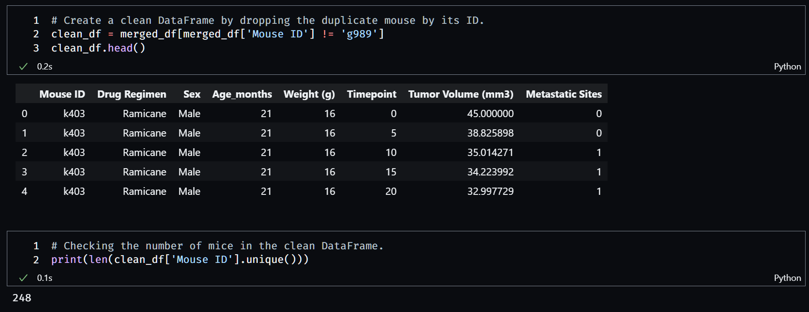

By returning the dataframe where mouse ID does not equal g989, I get all rows excluding the rows involving that particular mouse. I decided to exclude g989 entirely because I have no information as to which duplicated timepoint has the correct tumor volume or metastatic sties. I know I have successfully excluded mouse g989 by checking the number of unique mice in the remaining data frame, which is now 248 compared to the previous count of 249.

### Summary Statistics Using Individual Data Functions

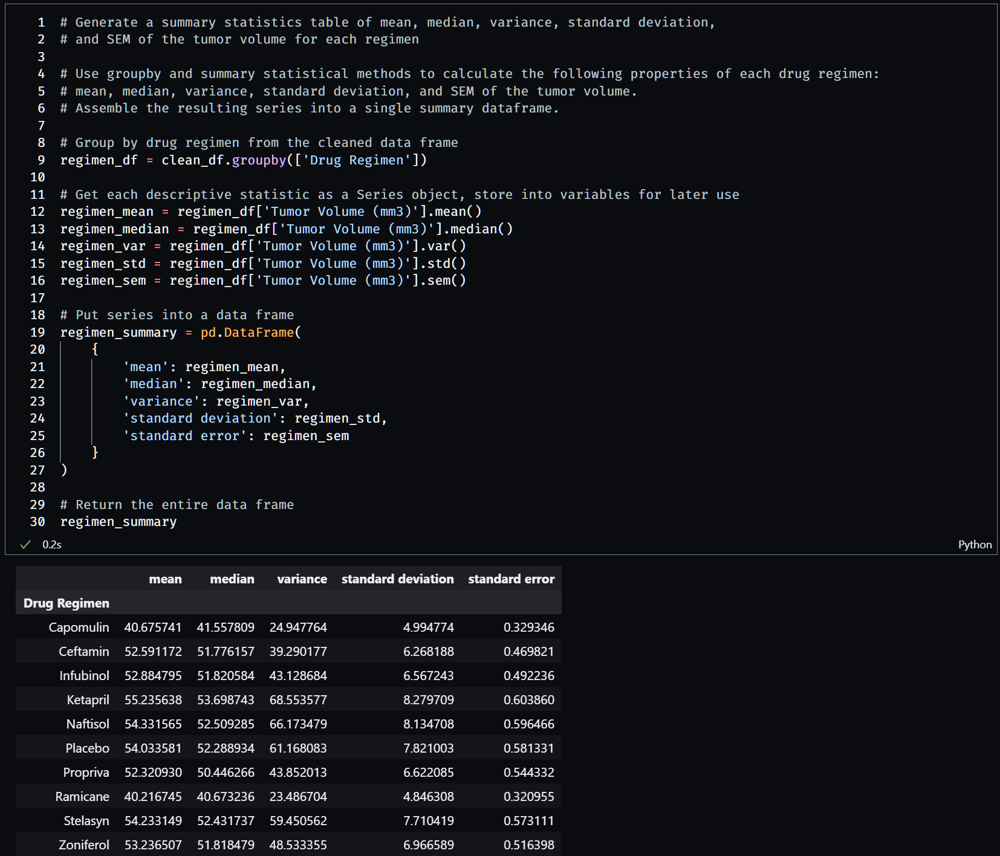

This method of providing the summary statistics is what I was most comfortable with doing at the time I did this problem. I first grouped the cleaned dataframe by the drug regimen, and then found the mean, median, variance, standard deviation, and standard error values by the individual data functions on the grouped frame. I then compiled them into a summary dataframe for presentation.

### Summary Statistics Using Aggregate Data Functions

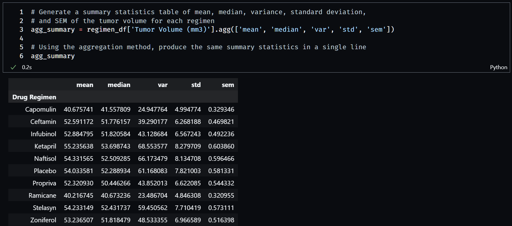

This method was completely new to me, and looking at the documentation I find that this method is much more powerful as it can take in as many data functions as needed to produce the desired descriptive statistics all at once. I will definitely be using this method more in the future.

### Bar Chart Using Pandas

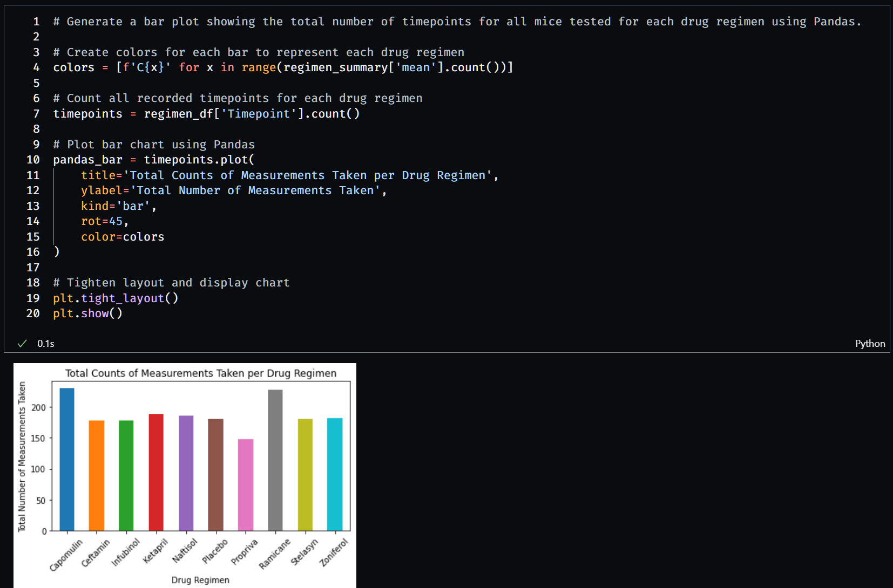

Because I was having issues getting the colors of each bar in the graph to be different colors, I ended up creating a list of color sequences (C0, C1, etc.) by using a list comprehension to create as many color sequences as there were drugs. I counted the number of timepoints for each drug regimen as this bar chart would be looking specifically for the total number of timepoints for each drug tested. Using the built-in Pandas plot() method, I created the bar chart on the grouped count of timepoints, provided labels, added a title, and adjusted some minor visual settings before calling `plt.show()` to present the figure.

### Bar Chart Using Matplotlib Pyplot

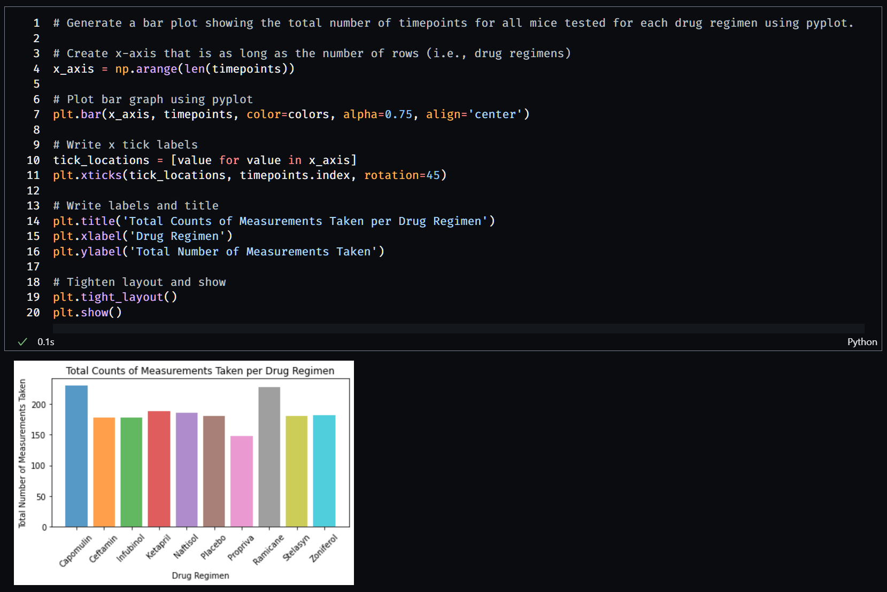

To properly configure the x-axis in the matplotlib version, I created an array of using numpy that were as long as the number of rows in the grouped timepoints dataframe (number of drugs). This is because matplotlib's bar plot function requires the values in which to place the bars, and since I am working with categorical data, I need to translate that to points on a graph. Plotting with matplotlib is straight forward after providing the x values and y values for each. The x tick labels were defined using xticks, and the title and axis labels were also separately defined.

### Pie Chart Using Pandas

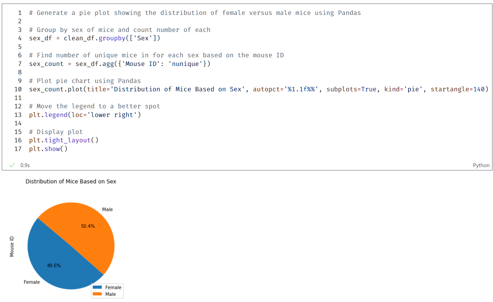

After grouping the cleaned dataset by the mice's sex, I used an aggregate function where it would use the groupby unique function on the Mouse ID column in the sex-grouped dataframe. This gives me a count of all unique mice within each sex. Using Pandas to create the pie chart, I noticed that the automatic legend that appeared completely overlapped a portion of the data, so I manually moved the legend to the lower right side of the figure.

### Pie Chart Using Matplotlib Pyplot

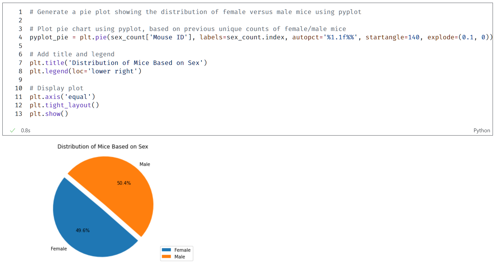

Using the same grouped count from the previous cell, I plotted the pie and separated the pie slice for female mice for added distinction. With pyplot, the labels did not automatically generate as pyplot takes in values manually, as opposed to Pandas plotting using the dataframe itself and grabbing labels as needed. I also had to manually include the legend but I was able to display a "more rounder" pie using the `plt.axis('equal')` call.

### Obtaining the Last Recorded Timepoints for each Mouse

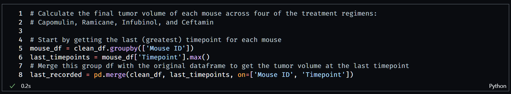

After grouping the cleaned dataframe by the mouse ID, I obtained the last recorded timepoint value for each mouse. As the timepoint are values based on days, the higher the timepoint value, the further along in time the mouse was observed. I then merged this grouping of timepoints back into the cleaned dataframe and only obtained those rows where both the mouse ID and its maximum timepoint value were in the cleaned dataframe (functionally equivalent to a SQL INNER JOIN call).

### Obtaining the Quartile Information

#### Code

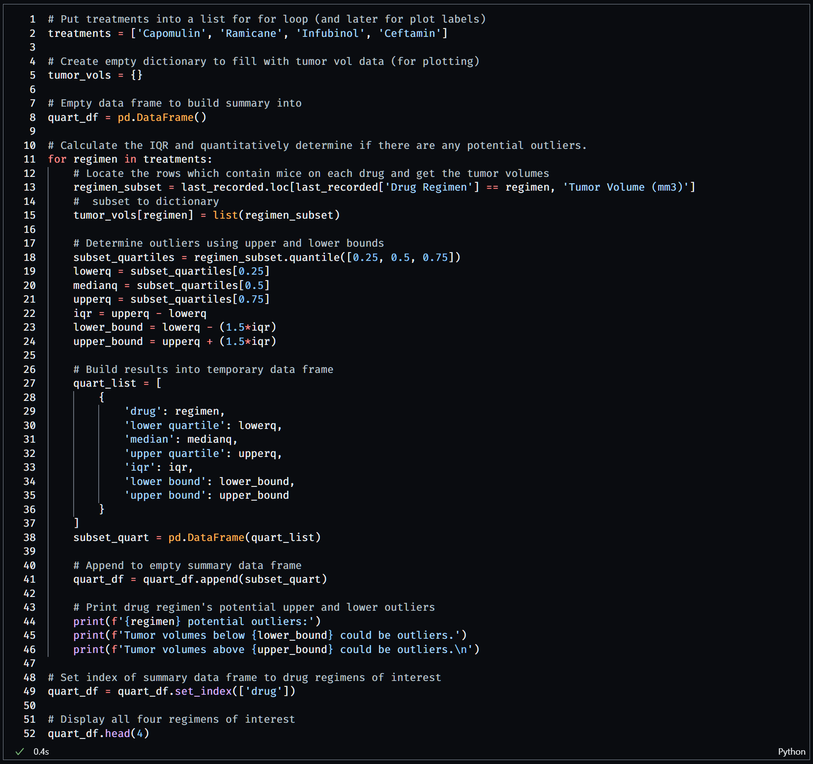

In the code, I put all treatments of interest into a list to iterate through for the loop. I opted to **not** use the suggested method of using an empty list to fill with tumor data, and instead I opted to use an empty **dictionary**. The reason for this is because it helped tremendously later on when creating the four box plots as I could call the dictionary and have it create everything I needed in one line, along with being able to immediately call the keys to set appropriate tick labels.

I then created an empty summary dataframe to append the quartile information for each drug.

For each drug in the list of treatments, I created a sub dataframe from the dataframe of last recorded timepoints of each mouse and filtered it further based on the drug of interest, and only returned the tumor volume values. I put these tumor volume values into the dictionary, with the drug of interest as the key.

For the quartile information, I used the Pandas `quantile()` method.

#### Results

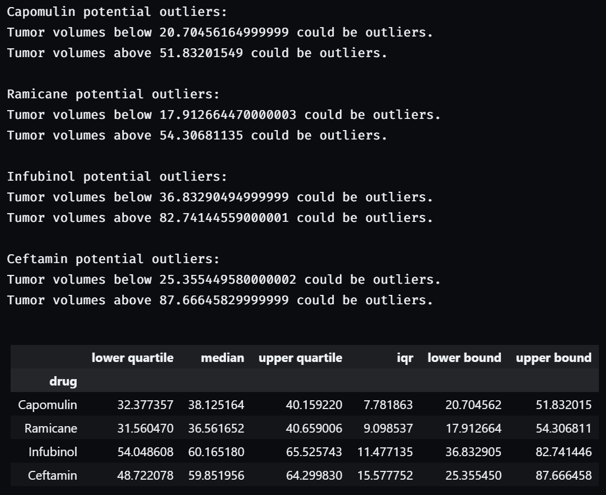

I printed the outer and lower bounds for each drug and compiled the quartile information for each drug. What this does *not* show are what values specifically are potential outliers, though it could be found by iterating through the list of values for each drug in the dictionary and comparing the number against the lower and upper bounds.

### Box Plots Across Four Drug Regimens

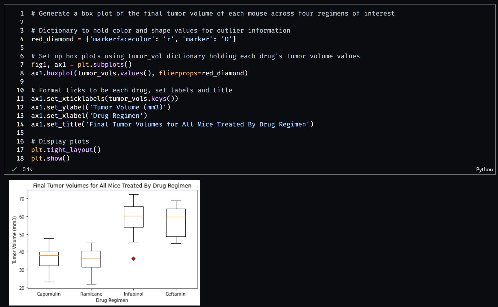

To change the color and shape of the outliers, I needed a dictionary to hold key-value pairs related to the marker's color and shape. After initializing the figure and axes, I called the `boxplot()` method using *all* values in the tumor volumes dictionary, while configuring the outliers using the red diamond dictionary I defined earlier. Calling the box plot on a dictionary of values means that I can get all four box plots at once and can then configure the labels according using the keys of the dictionary.

### Line Plot Using Mouse i557

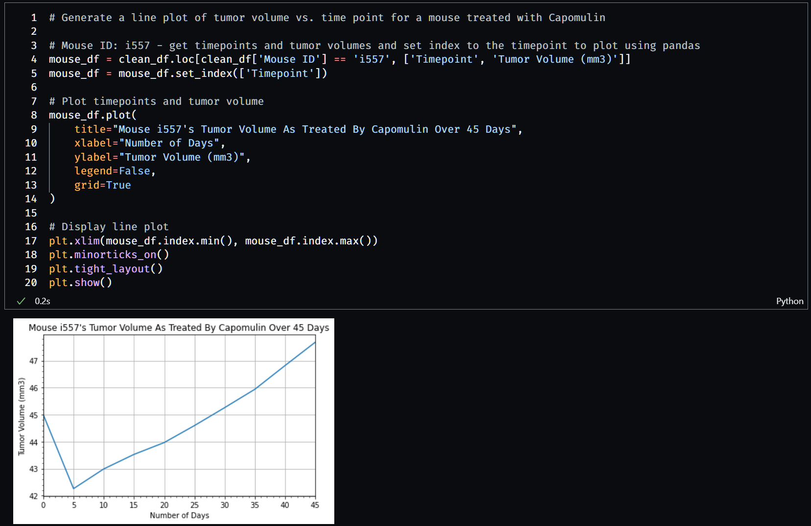

I found the subset of data in the cleaned dataframe where the mouse ID was i557, a mouse that was treated by Capomulin. I only wanted the timepoint and tumor volume columns so I could plot their relationship on a line plot. To be able to call the Pandas `plot` method, I set the index to be the timepoints, so the method would automatically know which variable belonged on which axis.

I set the limits of the figure to be the minimum and maximum values of the timepoints, as without those limits the figure would be constructed with small gaps on either side, and I did not like the look of the plot with those gaps. I also turned both the grid and minor ticks on in order to better track the values of the line visually.

### Creating a Scatter Plot for Unique Mice Treated by Capomulin

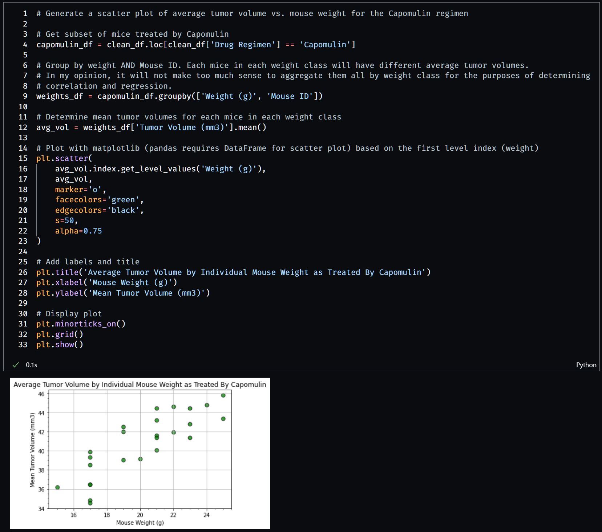

I started by finding the subset of mice that were treated by Capomulin. I decided to go one step further than the instructions had asked for and instead found the weights of *each unique* mouse treated by Capomulin. The reason I did this was because I thought it would be strange to find the average tumor volume of all mice in a particular weight class aggregated together, as each mouse could have massively different tumor volumes relative to one another within a weight class. For the purposes of finding an accurate potential correlation with regards to weight and average tumor volume, I thought it prudent to separate it in this manner.

After grouping by weight and ID, I found the average tumor volumes for each mouse in each weight class and plotted them using matplotlib.pyplot. According to the [Pandas documentation](https://pandas.pydata.org/docs/reference/api/pandas.DataFrame.plot.html), `plot()` can only take DataFrame objects with regards to making scatter plots. As I already had my x and y values prepared, I decided to skip making the dataframe as it would be an unnecessary step, and therefore I used the matplotlib.pyplot version.

### Drawing the Regression Line and Finding the R-Value

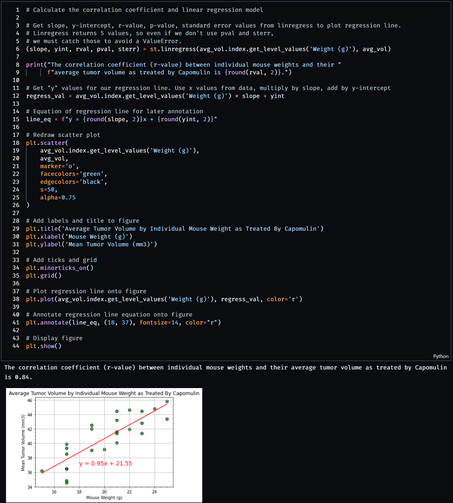

We learned two ways to find the Pearson correlation coefficient values. The first was using SciPy's `.pearsonr()` method, which returns both the r-value and p-value between two variables as a tuple. The second way, which is what I used, is to call SciPy's `.linregress()` method, which returns the five values of slope, intercept, r-value, p-value, and standard error. The reason why I used this second method is because I needed to draw the regression line onto the scatter plot I made in the previous cell. Therefore, I took advantage of this requirement and just grabbed the r-value returned by the `linregress` method.

The "regression values" are the y-values of the regression line. Mathematically, they are simply translations of the x-axis of the scatter plot, multiplied by the slope of the regression line and increased by the y-intercept. I then stored the equation of the regression line to annotate onto the plot.

I redrew the scatter plot, but before calling `plt.show()` I plotted the line using these regression values (but still using the same x-axis) and annotated the line with the equation of the regression line. Doing all of this before calling `plt.show()` means that both plots will appear on the same figure.
